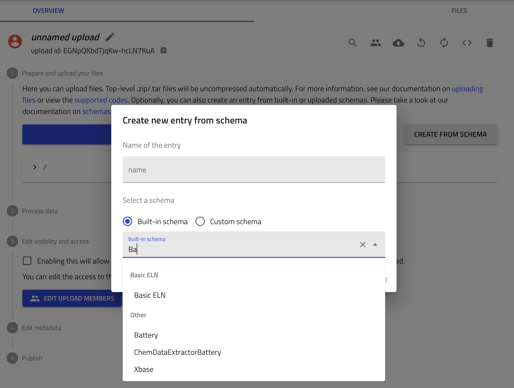
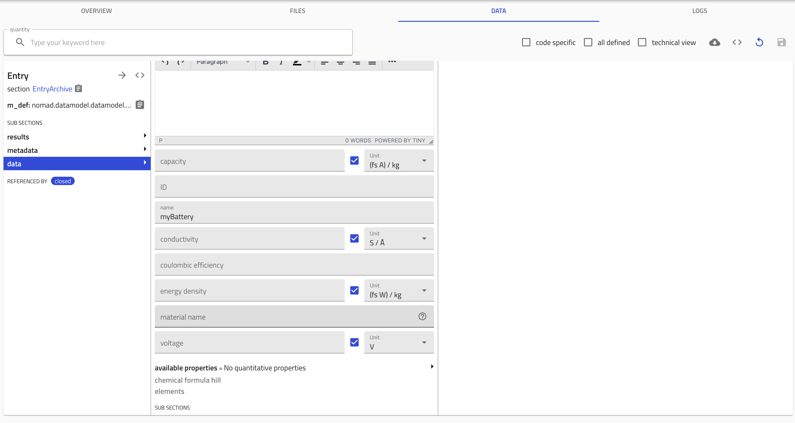
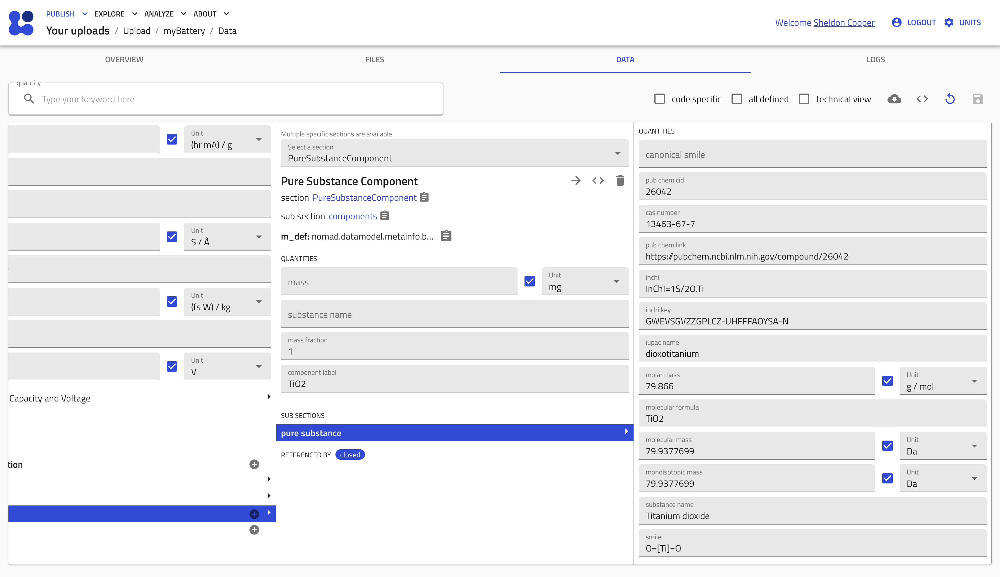

# How to Add Your Own Battery Data

You can contribute your own experimental or computational battery data to NOMAD. By creating a new entry and using the built-in `Battery` schema, you can ensure your data is correctly formatted and discoverable through the Battery Database application.

This guide will walk you through the process of creating a new entry and populating it with your data.

### Step 1: Create a New Upload

1.  Navigate to the **PUBLISH** menu in the top-left corner of the NOMAD interface and select **Your uploads**.
2.  On the uploads page, you can either add files (yaml format) to an existing upload or create a new one. Click the **CREATE A NEW UPLOAD** button to start a new, unpublished upload session.

*(Image: The "Your uploads" page showing the "CREATE A NEW UPLOAD" button.)*
{width="500"}

This will take you to a new "unnamed upload" page where you can add your data.

*(Image: The new "unnamed upload" page interface.)*

### Step 2: Create an Entry from the Battery Schema

Instead of uploading a file, you can create a new entry directly in the browser using a predefined schema.

1.  In the "Prepare and upload your files" section, click the **CREATE FROM SCHEMA** button.
2.  A dialog box titled "Create new entry from schema" will appear.
3.  **Name of the entry**: Provide a descriptive name for your battery data entry (e.g., `MyTIO2_Battery_Test`).
4.  **Select a schema**:
    *   Ensure the **Built-in schema** option is selected.
    *   In the search box, type `Battery` to find the correct schema.
    *   Select **ChemDataExtractorBattery** from the list.
5.  Click **CREATE**.

*(Image: The "Create new entry from schema" dialog, with "Battery" selected.)*

### Step 3: Add Battery Properties

After creating the entry, you will be directed to the **DATA** tab. This is where you will input the specific properties of your battery material.

1.  On the left-hand side, navigate to the `data` section within the `EntryArchive`.
2.  Fill in the quantitative properties for your material. You can specify the value and the correct unit for each field:
    *   `capacity`
    *   `voltage`
    *   `coulombic efficiency`
    *   `energy density`
    *   `conductivity`
    *   `material name`

*(Image: The data entry fields for battery properties.)*

### Step 4: Define the Material using the Component System

To define the chemical components of your material, you can add a `PureSubstanceComponent` section. This allows you to specify detailed chemical information for better data integration.

1.  Within your entry's `data` section, add a new subsection for defining the material's components.
2.  Select the **PureSubstanceComponent** to describe a single chemical substance.
3.  In this section, you can provide detailed information about the material, such as:
    *   **substance name**: The common name of the material (e.g., `Titanium dioxide`).
    *   **cas number**: The CAS registry number.
    *   **pub chem link**: A direct URL to the PubChem entry.
    *   **iupac name**, **molecular formula**, **molecular mass**, etc.

This structured data is crucial for making your entry easy to find, filter, and compare with other materials in the database.

*(Image: Detailed view of the PureSubstanceComponent section with various chemical identifiers.)*

### Step 5: Publish Your Data

Once you have filled in all the relevant data, return to the main upload page for your "unnamed upload".

1.  **Process data**: Ensure the processing of your new entry is complete.
2.  **Edit visibility and access**: You can choose to make the data public or share it with specific users. To make it visible in the main database, you must enable public visibility.
3.  **Publish**: After reviewing your data and setting the access rights, click the **Publish** button to finalize the upload.

After publishing, your data will be indexed and will become searchable and viewable within the **Battery Database** application. (Currently this feature is not yet available)