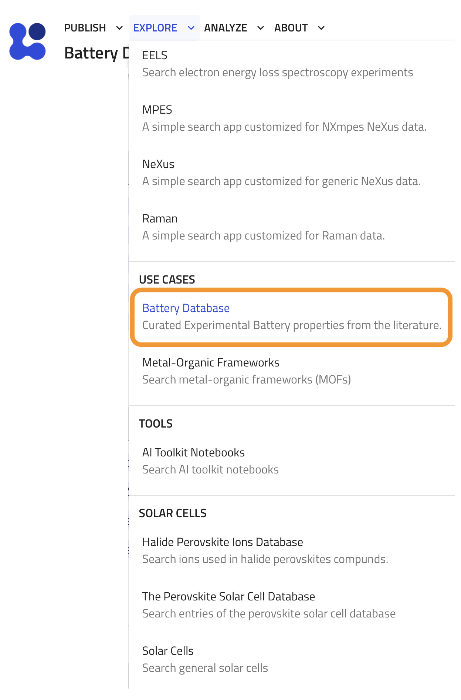
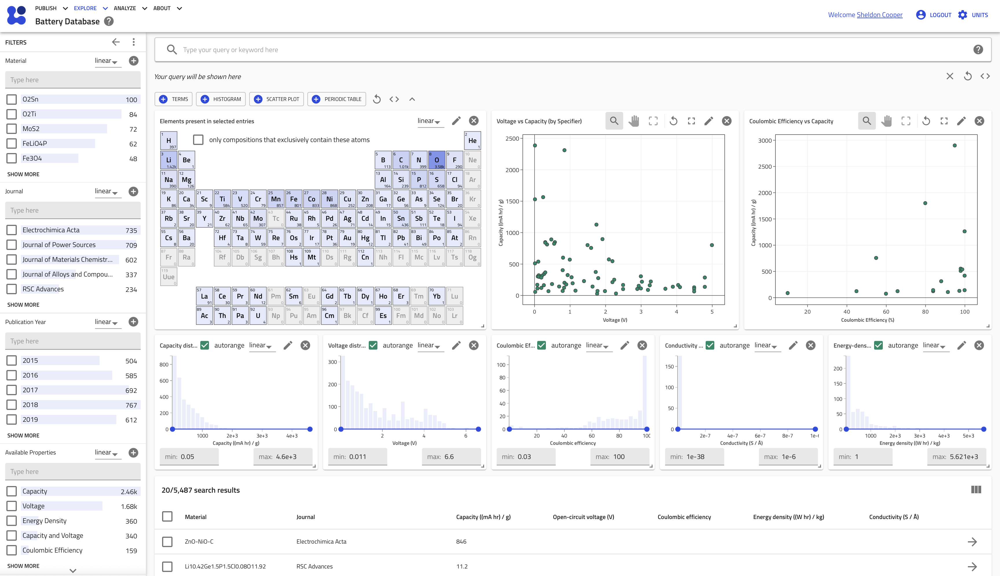

# Searching and Exploring Battery Data

The NOMAD Battery Materials Plugin provides a powerful, dedicated search and visualization interface to help you explore the curated battery materials data. This application is specifically designed to work with entries that conform to the `ChemDataExtractorBattery` schema.

### Accessing the Battery Database App

You can find the dedicated search page in the NOMAD UI by navigating to the **Explore** menu and selecting **Battery Database** under the **USE CASES** section, as highlighted below.

{width="500"}

This will take you to the homepage for the battery database. The page provides an interactive environment composed of three main components, as seen in the screenshot below:

1.  **Filter Panel**: On the left, a set of filters to narrow down your search.
2.  **Interactive Dashboard**: At the top, a series of plots and widgets that visualize the data from your current search results.
3.  **Results Table**: At the bottom, a detailed, sortable table of all entries matching your search criteria.

*(insert ScreenshotBatteryHomepage.png here)*

---

### Key Features of the Search Interface

#### 1. Filtering Your Data

The left-hand menu provides several filters to refine your search based on specific metadata and properties.

-   **Material**: Filter entries by their **Hill-ordered chemical formula**. An input box allows you to type in a specific formula to search for.
-   **Journal**: Find data from specific scientific journals. An input box helps you search for a journal by name.
-   **Publication Year**: Filter entries by the year of publication.
-   **Available Properties**: Select entries based on the quantitative properties they contain, such as "Capacity," "Voltage," or a combination like "Capacity and Voltage."
-   **Specifier**: Filter by the property specifier, which provides context for a measurement (e.g., `discharge capacity`, `theoretical capacity`).
-   **Tag**: Filter by the data origin tag (e.g., `CDE` for data from ChemDataExtractor, `Calculated` for derived data).

#### 2. Visualizing Data with the Dashboard

The dashboard offers several interactive widgets that update automatically as you filter your data.

-   **Periodic Table (`Elements present in selected entries`)**: This widget highlights the chemical elements that are present in the materials from your current search results.
-   **Property Distribution Histograms**: A series of histograms show the distribution of key quantitative properties across the selected entries:
    -   **Capacity distribution** (in mAh/g)
    -   **Voltage distribution** (in V)
    -   **Coulombic Efficiency distribution**
    -   **Conductivity distribution**
    -   **Energy-density distribution** (in Wh/kg)
-   **Scatter Plot (`Voltage vs Capacity`)**: This plot visualizes the relationship between voltage and capacity, helping you identify trends and compare different materials at a glance.

#### 3. The Results Table

The table at the bottom of the page displays detailed information for each entry that matches your filters. You can click on any column header to sort the results.

The following columns are available:

| Column Header            | Description                                              | Shown by Default |
| ------------------------ | -------------------------------------------------------- | :--------------: |
| **Material**             | The name of the battery material.                        |        ✅        |
| **Journal**              | The journal where the data was published.                |        ✅        |
| **Publication Year**     | The year of publication.                                 |                  |
| **Capacity**             | The specific capacity in `mA*hour/g`.                    |        ✅        |
| **Open-circuit voltage** | The open-circuit voltage in `V`.                         |        ✅        |
| **Coulombic efficiency** | The Coulombic efficiency (dimensionless).                |        ✅        |
| **Energy density**       | The energy density in `W*hour/kg`.                       |        ✅        |
| **Conductivity**         | The material's conductivity.                             |        ✅        |
| **Formula (Hill)**       | The chemical formula in Hill notation.                   |                  |
| **Entry ID**             | The unique identifier for the NOMAD entry.               |                  |
| **Upload time**          | The date and time the entry was uploaded.                |                  |

You can customize the visible columns by using the column selection tool on the right side of the table header.

---

### Example Use Case

Imagine you want to find all **carbon-based material** with a **capacity greater than 500 mAh/g** reported in the **Journal of Power Sources**.

1.  **Filter by Journal**: In the "Journal" filter on the left, type `Journal of Power Sources` and select it.
2.  **Filter by Material**: In the "Material" filter, you could type `C` to see materials containing carbon.
3.  **Filter by Property**: Use the "Capacity distribution" histogram on the dashboard. Click and drag to select the range from 500 mAh/g to the maximum value.
4.  **Analyze Results**: The results table will now only show entries that match these criteria. You can sort the table by the "Capacity" column to find the material with the highest performance. The other dashboard widgets will update to show you the elemental distribution and voltage ranges for this specific subset of materials.